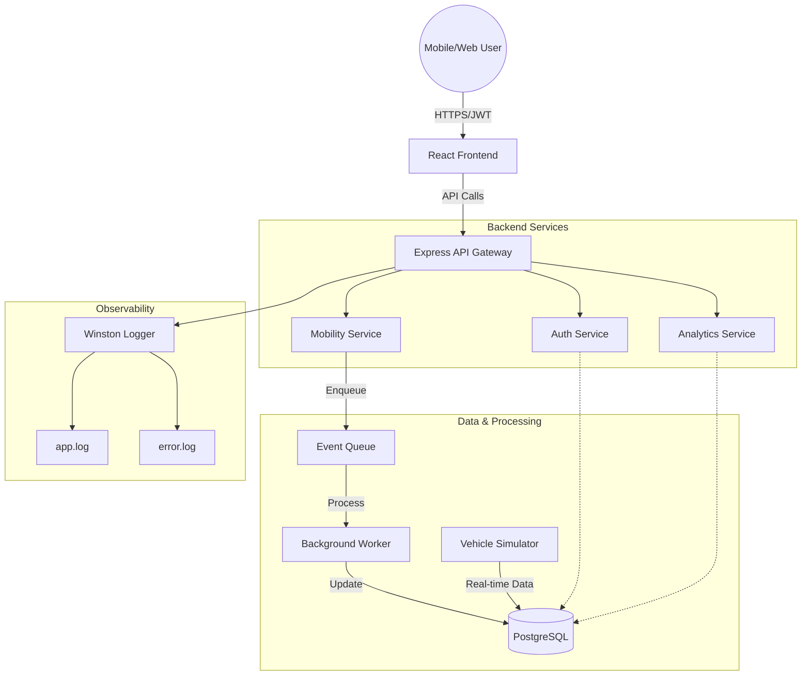

# UrbanMove  - Smart Mobility Platform

UrbanMove is a production-ready cloud-native backend and frontend prototype for a smart mobility platform. It handles user authentication, trip management, real-time vehicle simulation, and analytics.

## 🏗 Full Cloud Architecture Overview

UrbanMove implements a multi-layer cloud-native architecture designed for scalability, resilience, and security.

### Architectural Layers
- **User Layer**: Mobile and web clients interacting via HTTPS.
- **Frontend Layer**: A responsive React (Vite) application providing a rich user interface.
- **API Gateway/Entry Layer**: Express.js server acting as the entry point, handling routing and security.
- **Service Layer**: Decoupled business logic services (AuthService, MobilityService, AnalyticsService).
- **Data Layer**: Persistent PostgreSQL storage for structured data (Users, Trips).
- **Event Processing Layer**: An internal event queue and background worker for asynchronous task processing.
- **Observability Layer**: Centralized logging using Winston to track system health and errors.



## ☁️ AWS Architecture Design

This prototype maps directly to professional AWS managed services, providing a clear path from development to production.

- **Compute**: Currently hosted on **AWS EC2** (t2.micro). In production, this would scale to **AWS ECS** or **EKS** for container orchestration.
- **Containerization**: **Docker** ensures consistent environments across local development and EC2 deployment.
- **Database**: PostgreSQL is currently containerized. Production environments would utilize **Amazon RDS (PostgreSQL)** for automated backups and Multi-AZ high availability.
- **Asynchronous Messaging**: The internal queue mimics **Amazon SQS** or **Amazon MSK (Kafka)**, decoupling trip creation from intensive processing.
- **Networking**: Deployment within an **AWS VPC** using public subnets for the web/API layer and private subnets for the database layer.
- **Load Balancing**: An **Application Load Balancer (ALB)** would handle SSL termination and distribute traffic across multiple EC2 instances.
- **Security**: Controlled via **AWS Security Groups** (limiting ports 22, 3000, 5173) and **IAM Roles** for resource access.

## 🔒 Networking & Security

- **VPC Design**: The system is designed to reside in a Virtual Private Cloud (VPC).
- **API Exposure**: Access is strictly controlled through specific port exposures:
    - `Port 22`: Secure SSH access for administration.
    - `Port 3000`: Backend API access.
    - `Port 5173`: Frontend development server access.
- **Authentication**: **JWT (JSON Web Tokens)** are used for stateless authentication. Tokens are stored in `localStorage` and sent via the `Authorization` header.
- **Secret Management**: Environment variables are managed via `.env`. Future iterations will integrate **AWS Secrets Manager** for rotation and enhanced security.

## 📈 Scalability & High Availability

- **Horizontal Scaling**: The stateless Express backend allows for horizontal scaling (adding more instances) via **AWS Auto Scaling**.
- **Container Portability**: Docker allows the entire stack to be moved between cloud providers or on-premise servers without code changes.
- **Availability Zones**: Production deployment would span multiple **Availability Zones (AZs)** to ensure 99.9% uptime.
- **Database Resilience**: Managed via RDS read-replicas to handle high read traffic and provide failover capability.

## 📊 Data & Event Architecture

- **Structured Storage**: PostgreSQL ensures data integrity for users and trip history.
- **Event-Driven Workflow**: When a trip is created, an event is pushed to the queue. The background worker processes this independently, ensuring the user receives a fast response.
- **Real-time Simulation**: A dedicated service simulates real-time vehicle movement, providing a dynamic data source for analytics.

## 👁️ Observability & Monitoring

- **Logging**: **Winston** provides structured JSON logs.
- **Persistence**: Logs are rotated and stored in `logs/app.log` (info) and `logs/error.log` (errors).
- **Future Integration**: In production, these logs would be streamed to **Amazon CloudWatch** for real-time alerting and dashboarding.

## 🛡️ Disaster Recovery

- **Backup Policy**: Prototype backups involve volume snapshots. Production uses **RDS Automated Snapshots** with a 30-day retention.
- **Recovery Time Objective (RTO)**: Designed for rapid recovery via Docker image redeployment.
- **Failover**: Conceptual integration with **Amazon Route 53** for cross-region failover.

## 💰 Cost Optimization

- **Resource Efficiency**: Optimized for the **AWS Free Tier** (t2.micro).
- **Lean Containers**: Using `node:18-slim` to minimize image size and storage costs.
- **On-Demand Scaling**: Architecture supports scaling down during low-traffic periods to minimize operational costs.

## 🔄 Prototype vs. Production Mapping

| Component | Prototype (Current) | Production (AWS Managed) |
| :--- | :--- | :--- |
| **Compute** | EC2 Instance | AWS ECS / EKS / Fargate |
| **Database** | Dockerized PostgreSQL | Amazon RDS (PostgreSQL) |
| **Queue** | In-memory Array | Amazon SQS / Amazon MSK |
| **Logging** | Local File System | Amazon CloudWatch Logs |
| **Load Balancer**| Direct IP Access | Application Load Balancer (ALB) |
| **Secrets** | `.env` file | AWS Secrets Manager |
| **Frontend** | Vite Dev Server | Amazon S3 + CloudFront |

## 🛠 Tech Stack

- **Backend**: Node.js, Express.js, JWT, Winston, UUID, node-postgres (pg).
- **Frontend**: React (Vite), Axios, Framer Motion, Lucide React.
- **Database**: PostgreSQL.
- **DevOps**: Docker, Docker Compose.

## 🚀 Getting Started

### Prerequisites
- Node.js 18+
- Docker (optional)

### Local Development

1. **Backend**:
   ```bash
   npm install
   node index.js
   ```
   The server will run on `http://localhost:3000`.

2. **Frontend**:
   ```bash
   cd frontend
   npm install
   npm run dev
   ```

### Docker Run

To run the entire system in containers:
```bash
docker-compose up --build
```

## 📈 API Endpoints

- `GET /`: Health check and status.
- `GET /health`: Detailed status check.
- `POST /auth/register`: Create a new user.
- `POST /auth/login`: Get JWT token.
- `POST /mobility/trip`: Create a new trip (Auth required).
- `GET /analytics`: Get platform stats (Auth required).

## 📝 Logging

- `logs/app.log`: General application activity.
- `logs/error.log`: Error stack traces and issues.

## ☁️ AWS EC2 Deployment Guide

To deploy this platform to an AWS EC2 instance, follow these steps:

### 1. Launch an EC2 Instance
- **AMI**: Ubuntu Server 22.04 LTS (Recommended).
- **Instance Type**: t2.micro (Free Tier eligible).
- **Security Group**: Allow **Inbound Rules** for:
  - SSH (Port 22) - for access.
  - HTTP (Port 80) - for web traffic (if using a reverse proxy).
  - Custom TCP (Port 3000) - for the Backend API.
  - Custom TCP (Port 5173) - for the Frontend (if running in dev mode) or Port 80 for production build.

### 2. Connect to your Instance
```bash
ssh -i your-key.pem ubuntu@your-ec2-ip
```

### 3. Install Dependencies (Docker approach recommended)
```bash
sudo apt update
sudo apt install docker.io docker-compose -y
sudo usermod -aG docker $USER
# Log out and log back in for group changes to take effect
```

### 4. Clone and Run
```bash
git clone <your-repo-url>
cd urbanmove
docker-compose up -d --build
```

### 5. Update Frontend API URL
In `frontend/src/App.jsx`, ensure the `API_BASE_URL` is set to your EC2 Public IP:
```javascript
const API_BASE_URL = 'http://YOUR_EC2_IP:3000';
```

---
*Created for University Cloud Computing Project - 2026*
