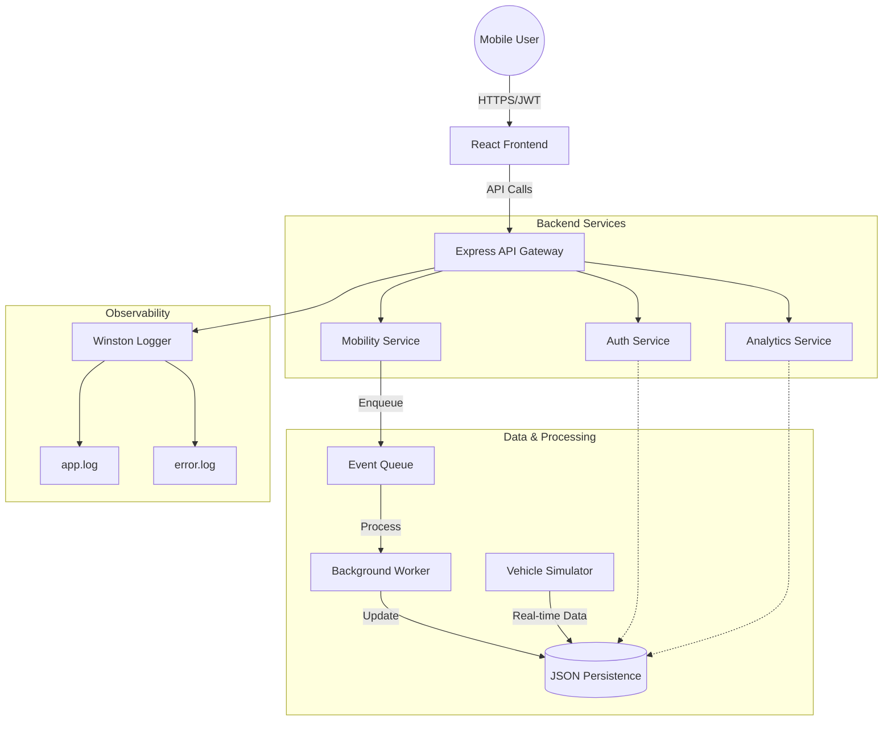

# UrbanMove 🚀 - Smart Mobility Platform

UrbanMove is a production-ready cloud-native backend and frontend prototype for a smart mobility platform. It handles user authentication, trip management, real-time vehicle simulation, and analytics.

## 🏗 Architecture Overview



The system follows a modular **Service-Based Architecture** (similar to MVC):

- **Routes**: Handle HTTP endpoints and delegate to controllers.
- **Controllers**: Manage request/response lifecycle.
- **Services**: Contain the core business logic (Auth, Mobility, Analytics).
- **Models**: Act as an abstraction layer for data persistence.
- **Background Worker**: Processes event queues (simulating Big Data pipelines).
- **Vehicle Simulator**: Generates real-time mobility data every 3 seconds.

## ☁️ Cloud Mapping

This project is designed to mirror real-world cloud architectures:

- **AWS EC2 (Compute)**: The backend and frontend can be deployed on EC2 instances.
- **Docker (Containerization)**: Both components are container-ready for consistent deployment.
- **PostgreSQL (Persistence)**: Using **PostgreSQL 15** for reliable, relational data storage. In production, this would be swapped for **Amazon RDS (PostgreSQL)**.
- **Event Queue (Messaging)**: The internal memory-based queue represents **Amazon SQS** or **Apache Kafka** for decoupled processing.
- **Winston (Observability)**: Standard logging practice, which would be integrated with **AWS CloudWatch** in production.

## 🛠 Tech Stack

- **Backend**: Node.js, Express.js, JWT, Winston, UUID, node-postgres (pg).
- **Frontend**: React (Vite), Axios, Framer Motion, Lucide React.
- **Database**: PostgreSQL.
- **DevOps**: Docker, Docker Compose.

## 🔒 Security Implementation

- **Identity & Access Management**: Implemented using JWT (JSON Web Tokens) with a `devsecret` key.
- **Protected API Exposure**: Express middleware checks for valid `Authorization: Bearer <token>` on all mobility and analytics routes.
- **Data Protection**: User data is isolated, and trips are associated with specific `userId`s to prevent unauthorized access.
- **Secure Configuration**: Critical secrets are managed via `.env` variables.

## 📈 Scalability & High Availability Strategy

- **Stateless Backend**: The Express server is designed to be stateless, allowing it to scale horizontally behind a Load Balancer (like AWS ELB).
- **Decoupled Processing**: Using an event-driven worker pattern ensures that heavy trip processing doesn't block the main API response.
- **Database Abstraction**: While currently using JSON for the prototype, the `models/` layer can be seamlessly swapped with **Amazon RDS** or **DynamoDB** for high availability.

## 🚀 Getting Started

### Prerequisites
- Node.js 18+
- Docker (optional)

### Local Development

1. **Backend**:
   ```bash
   npm install
   node index.js
   ```
   The server will run on `http://localhost:3000`.

2. **Frontend**:
   ```bash
   cd frontend
   npm install
   npm run dev
   ```

### Docker Run

To run the entire system in containers:
```bash
docker-compose up --build
```

## 📈 API Endpoints

- `GET /`: Health check and status.
- `POST /auth/register`: Create a new user.
- `POST /auth/login`: Get JWT token.
- `POST /mobility/trip`: Create a new trip (Auth required).
- `GET /analytics`: Get platform stats (Auth required).

## 📝 Logging

- `logs/app.log`: General application activity.
- `logs/error.log`: Error stack traces and issues.

## ☁️ AWS EC2 Deployment Guide

To deploy this platform to an AWS EC2 instance, follow these steps:

### 1. Launch an EC2 Instance
- **AMI**: Ubuntu Server 22.04 LTS (Recommended).
- **Instance Type**: t2.micro (Free Tier eligible).
- **Security Group**: Allow **Inbound Rules** for:
  - SSH (Port 22) - for access.
  - HTTP (Port 80) - for web traffic (if using a reverse proxy).
  - Custom TCP (Port 3000) - for the Backend API.
  - Custom TCP (Port 5173) - for the Frontend (if running in dev mode) or Port 80 for production build.

### 2. Connect to your Instance
```bash
ssh -i your-key.pem ubuntu@your-ec2-ip
```

### 3. Install Dependencies (Docker approach recommended)
```bash
sudo apt update
sudo apt install docker.io docker-compose -y
sudo usermod -aG docker $USER
# Log out and log back in for group changes to take effect
```

### 4. Clone and Run
```bash
git clone <your-repo-url>
cd urbanmove
docker-compose up -d --build
```

### 5. Update Frontend API URL
In `frontend/src/App.jsx`, ensure the `API_BASE_URL` is set to your EC2 Public IP:
```javascript
const API_BASE_URL = 'http://YOUR_EC2_IP:3000';
```

---
*Created for University Cloud Computing Project - 2026*
